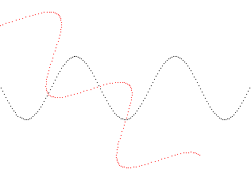

# 函数绘图语言解释器

编译原理大作业，使用lex&yacc完成

## 示例

输入：

```
// 设置原点的偏移量
ORIGIN IS (1,E);

-- 设置横坐标和纵坐标的比例
SCALE IS (1,2);

FOR T FROM 0 TO 5*PI STEP 0.1 DRAW(20*T, 20*(SIN(T)+E)); -- 绘图

COLOR IS (255,0,0); // 设置颜色
ROT IS -PI/4; // 旋转角度
FOR T FROM 0 TO 5*PI STEP 0.1 DRAW(20*T, 20*COS(T)); // 绘图
```

输出：

